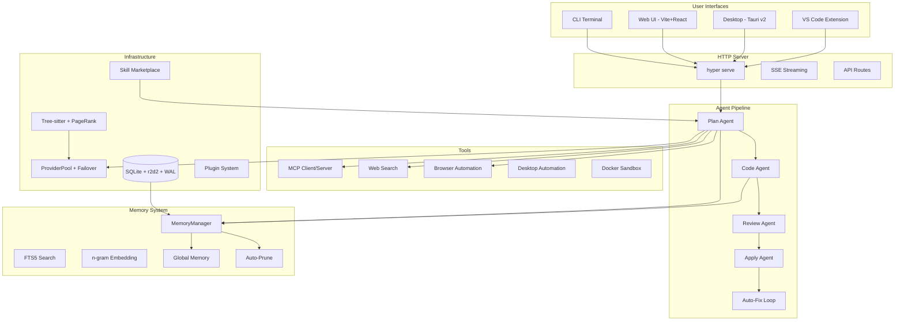
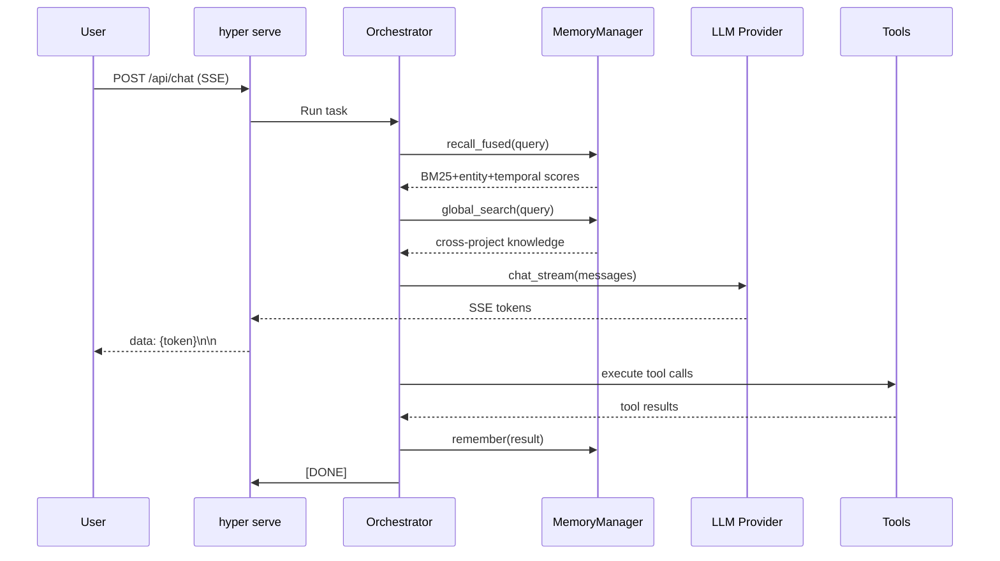

# HyperAgent Architecture

## System Overview



## Data Flow



## Module Map

```
src/
├── cli/           CLI commands (init, run, serve, analyze, swarm...)
├── agent/         Agent pipeline
│   ├── orchestrator.rs   Master agent loop
│   ├── mediator.rs       Agent coordination
│   └── tools.rs          Tool dispatch
├── llm/           LLM providers
│   ├── provider.rs       OpenAl-compatible API
│   ├── pool.rs           Provider failover pool
│   └── streaming.rs      SSE streaming response
├── memory.rs      Memory system (14 modes, FTS5, embedding)
├── index/         Tree-sitter code index + PageRank
├── serve.rs       HTTP server (axum + SSE)
├── analyze.rs     Deep code analysis
├── swarm.rs       Multi-agent parallel execution
├── ci_fix.rs      CI auto-fix
├── skill_market.rs Skill marketplace
├── eval.rs        Self-evaluation benchmark
├── sandbox.rs     Docker sandbox
├── mcp.rs         MCP client/server
├── plugin.rs      Plugin system
├── session.rs     Session management + share
├── i18n.rs        Internationalization (en + zh-CN)
└── config.rs      Configuration management
```
